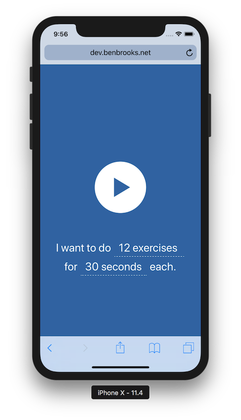

Like the 7-minute workout, but with more exercises and with the workout order randomly generated each time you listen.

### Learnings along the way
* iOS does not allow you to play sound from an [HTMLAudioElement](https://developer.mozilla.org/en-US/docs/Web/HTML/Element/audio) or the [Web Audio API](https://developer.mozilla.org/en-US/docs/Web/API/Web_Audio_API) unless the play results from a user interaction. This breaks sequencing sounds because iOS will refuse to play a second sound programmatically after the first is done because there's no new user interaction. Even [big fancy audio libraries](https://howlerjs.com/) break on iOS because of this. The only way to get around it is to recycle the same [HTMLAudioElement](https://developer.mozilla.org/en-US/docs/Web/HTML/Element/audio) or [AudioContext](https://developer.mozilla.org/en-US/docs/Web/API/AudioContext and and update their source appropriately instead of creating new audio objects.
* You can't use mp3 files for seamless looped audio since mp3s [always have a few milliseconds of silence added to the beginning and end](http://lame.sourceforge.net/tech-FAQ.txt). AAC/WebM/Ogg are better formats for loops depending on your browser compatibility needs.
* When looping an [HTMLAudioElement](https://developer.mozilla.org/en-US/docs/Web/HTML/Element/audio), Safari adds a small delay between each loop. This doesn't sounds very good if you're looping a beat. In order to get seamless loops with no delay, you have to use the [Web Audio API](https://developer.mozilla.org/en-US/docs/Web/API/Web_Audio_API)

### Todo:
* Use the Web Speech API instead of pre-recorded exercise name files
* Preload necessary audio
* Allow user to stop play and restart with new settings without waiting for the end of a workout or refreshing.
* Remember user's last settings
* ~Add a selection of background beats~
* ~Allow user to start a new sequence~
* ~Use promises and async/await instead of recursion for sequencing audio~
* ~Add more exercises~
* ~Allow user to customize number of exercises~
* ~Add a better UI for playing and pausing~
* ~Allow user to customize time between exercices~

##### Credit to: 
* Gan Khoon Lay for the favicon
* Zlatko Najdenovski for the play icon
* Charlie Bob Gordon for the pause icon
* [The Noun Project](https://thenounproject.com) for helping me find them
